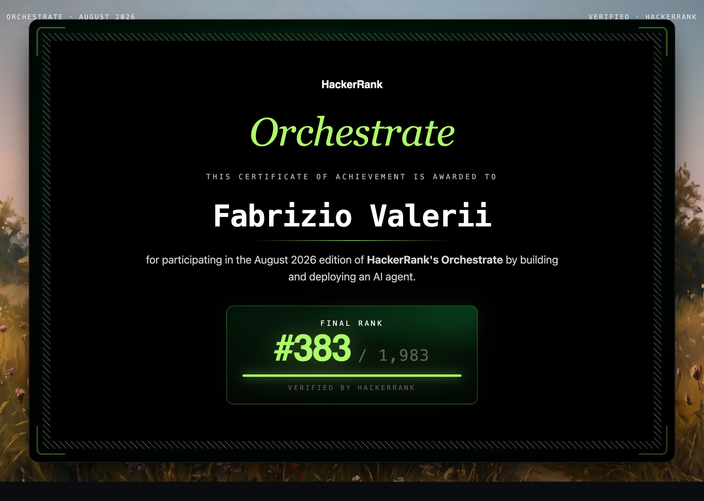

# Multimodal Message Notification Router (HackerRank Orchestrate Top 19% Finalist)

A multimodal WhatsApp notification router built for the **HackerRank Orchestrate** hackathon. For every incoming message — text, image poster/screenshot, or voice note — the system decides whether to **notify** the user now, **digest** it for later, or **mute** it, with a human-readable reason, a calibrated confidence score, and citations to relevant historical messages.

Built with **Claude Sonnet 5** (structured-output reasoning) and **Gemini 2.5 Flash** (voice-note transcription), on top of deterministic security guardrails and a text/behavioral evidence-retrieval engine.

> The original challenge brief lives in [`problem_statement.md`](./problem_statement.md). This README documents the solution that was built against it.

---

<p align="center">
  
</p>

---

## Results

Measured with `code/evaluation/main.py` and `code/evaluation/quality_checks.py` against `dataset/sample_messages.csv` (the only file with known-correct labels) and cross-checked against the full 110-message `dataset/messages.csv`:

| Metric | Result |
|---|---|
| Action accuracy (sample set) | Consistently hits 29-30/30 (96.7% - 100%) across repeated runs |
| Message-type accuracy (sample set) | Consistently hits 29-30/30 (96.7% - 100%) across repeated runs |
| Evidence ID validity (sample + full set) | 100% valid, 0 hallucinated/leaked IDs |
| Confidence bounds | 100% within `[0.0, 1.0]`, no ambiguous case over-confident |
| Reason consistency (manual spot-check) | short, specific, logically consistent with the decision |
| System-prompt size | 2,400 tokens (40.5% smaller than the first working version, same accuracy) |
| Adversarial rows in the real dataset (`msg_107`, `msg_108`, `msg_110`) | all correctly hard-muted by the guardrail layer before any LLM call |

Note on reproducibility: `claude-sonnet-5` does not expose a `temperature` parameter (it uses non-configurable adaptive thinking), so there is a small amount of run-to-run variance — typically 0-1 mismatches out of 30 sample rows across repeated runs, not a fixed prompt-content gap.

---

## Architecture

```text
dataset/*.csv ──► Data Loader & Context Joins ──► MessageContext (per message)
                  (code/data/loader.py)                   │
                                                            ▼
                                          ┌───────────────────────────────┐
                                          │ 1. Security Guardrails        │  deterministic, no API calls
                                          │    code/guardrails/security.py│  prompt-injection + scam heuristics
                                          └───────────────┬───────────────┘
                                       hard_routed=True    │   hard_routed=False
                                       (skip everything    │
                                        below, mute now)   ▼
                                          ┌───────────────────────────────┐
                                          │ 2. Media Pre-processing       │
                                          │    code/media/image.py        │  PIL resize/encode → base64
                                          │    code/media/audio.py        │  Gemini 2.5 Flash transcription
                                          └───────────────┬───────────────┘
                                                            ▼
                                          ┌───────────────────────────────┐
                                          │ 3. Evidence Retrieval          │  rapidfuzz text similarity +
                                          │    code/evidence/retrieval.py  │  behavioral signals from
                                          └───────────────┬───────────────┘  message_events.csv
                                                            ▼
                                          ┌───────────────────────────────┐
                                          │ 4. LLM Routing                 │  Claude Sonnet 5, structured
                                          │    code/routing/engine.py       │  output, retry on transient
                                          │    code/routing/prompts.py      │  failures
                                          │    code/routing/calibration.py  │  confidence/evidence sanitized
                                          └───────────────┬───────────────┘  after the model call
                                                            ▼
                                          code/output/writer.py ──► dataset/output.csv
```

Every message flows through the same four stages; the only branch is the guardrail fast path, which short-circuits stages 2-4 entirely for a confirmed scam or a severe prompt-injection attempt so a single successful jailbreak can never flip a `mute` to `notify`.

---

## Key design decisions

- **Security-first, not LLM-first.** Prompt-injection and scam/phishing detection (`code/guardrails/security.py`) run as cheap deterministic regex/heuristics *before* any model call. A high-confidence match hard-routes straight to `mute` — the LLM is never even given the chance to be talked out of it. Once a voice note is transcribed, the guardrails are re-evaluated over the transcript, so a spoken scam or injection attempt gets the same deterministic treatment as a typed one.
- **Untrusted-content framing.** Every piece of message content (text, transcript, OCR-visible image text, and the text of retrieved historical evidence candidates) is explicitly framed to the LLM as untrusted data, never as instructions — via the system prompt, `<UNTRUSTED_CONTENT>` tagging, and the per-message guardrail signals it's shown. This closes the "poisoned history" vector where an injection attempt hides inside a past message rather than the incoming one.
- **`message_type` taxonomy calibration.** The 11 allowed categories overlap in surface appearance (e.g. `business_update` vs. `event` vs. `promotion`, `scam` vs. `spam`, `forward` vs. `greeting`). The system prompt defines explicit disambiguation rules for each boundary and includes a compressed set of calibration examples drawn from `dataset/sample_messages.csv` (the file the challenge explicitly provides "to understand the expected output format and style") — never treated as evidence, never leaked into `evidence_message_ids`.
- **Confidence and evidence are never trusted blindly from the model.** `code/routing/calibration.py` deterministically re-validates `evidence_message_ids` against the actual retrieval candidates the model was shown (a hallucinated ID can never reach the output) and discounts confidence when media analysis was missing or unreliable.
- **Defense in depth for the fallback paths.** If Claude's structured output can't be parsed even after retries, or an API call fails outright, the pipeline degrades to a low-confidence `digest`/`unknown` decision instead of crashing — a transient infra problem should never produce a missing row. The same error boundary wraps every message's full pipeline pass (including media decoding edge cases like PIL decompression bombs and corrupt cache entries), so one pathological input degrades one row, never the whole run.
- **High-density prompt.** The system prompt was iteratively compressed (bulleted contrasts, single-line calibration examples, removal of prose that just re-explains schema constraints already enforced by Pydantic/structured-output) to cut token cost by 40%+ with no accuracy regression, verified via Anthropic's `messages.count_tokens` endpoint.

---

## Repository layout

```text
.
├── AGENTS.md                     # AI-agent operating rules for this repo (logging, contract)
├── problem_statement.md          # Original challenge brief
├── README.md                     # You are here
├── .env.example                  # Template for required API keys (copy to .env)
├── code/
│   ├── main.py                   # Pipeline orchestrator — entry point for a full run
│   ├── requirements.txt
│   ├── data/
│   │   ├── schemas.py            # Pydantic v2 models (MessageContext, RoutingDecision, ...)
│   │   └── loader.py             # CSV ingestion + relational joins into MessageContext
│   ├── guardrails/
│   │   └── security.py           # Prompt-injection + scam/phishing heuristics, hard-routing
│   ├── media/
│   │   ├── image.py               # PIL processing → base64 for Claude vision input
│   │   └── audio.py               # Gemini 2.5 Flash transcription, disk-cached
│   ├── evidence/
│   │   └── retrieval.py           # rapidfuzz similarity + behavioral evidence ranking
│   ├── routing/
│   │   ├── prompts.py             # SYSTEM_PROMPT + per-message context formatting
│   │   ├── engine.py              # Claude Sonnet 5 call, retries, hard-route fast path
│   │   └── calibration.py         # Post-hoc confidence/evidence sanitization
│   ├── output/
│   │   └── writer.py              # RoutingDecision list → dataset/output.csv
│   ├── evaluation/
│   │   ├── main.py                # Accuracy check against sample_messages.csv
│   │   └── quality_checks.py      # Evidence validity, confidence calibration, reason checks
│   └── cache/                     # Disk cache for Gemini audio results (git-ignored)
└── dataset/                       # Provided input CSVs + media/ (images, audio)
```

---

## Setup

Requires Python 3.11+.

```bash
# From the repo root
python -m venv .venv
source .venv/bin/activate          # Windows: .venv\Scripts\activate

pip install -r code/requirements.txt

cp .env.example .env
# then edit .env and fill in:
#   ANTHROPIC_API_KEY=...
#   GEMINI_API_KEY=...   (or GOOGLE_API_KEY=...)
```

`.env` is git-ignored and is loaded automatically by every entry point below via `python-dotenv` — no need to export variables into your shell manually. **Never commit `.env` or paste real keys into chat, commits, or logs.**

---

## Running the pipeline

All commands below are run from the repo root.

```bash
# Full run: routes every message in dataset/messages.csv, writes dataset/output.csv
python -m code.main

# Quick smoke run on just the first 10 messages
python -m code.main --limit 10

# Custom output path, verbose per-stage logging
python -m code.main --output-path out.csv --verbose
```

Missing API keys degrade gracefully rather than crashing: text-only messages route normally without `ANTHROPIC_API_KEY`-dependent stages failing silently (routing itself does need it), voice notes route without a transcript if no Gemini key is set, and any single failed Claude call falls back to a conservative low-confidence decision instead of stopping the run.

### Evaluation and quality checks

```bash
# Action/message_type accuracy against the 30 solved rows in sample_messages.csv
python -m code.evaluation.main

# Evidence validity, confidence calibration, and reason-consistency checks
# (works against sample_messages.csv by default, or the full target set)
python -m code.evaluation.quality_checks
python -m code.evaluation.quality_checks --filename messages.csv
```

---

## Output contract

`dataset/output.csv` contains exactly one row per `message_id` in `dataset/messages.csv`, with columns in this exact order:

```text
message_id,action,message_type,reason,confidence,evidence_message_ids
```

- `action` ∈ `{notify, digest, mute}`
- `message_type` ∈ `{personal, urgent, event, payment, business_update, promotion, greeting, forward, spam, scam, unknown}`
- `confidence` is a float in `[0.0, 1.0]`
- `evidence_message_ids` is `none`, or one or more `message_history.csv` IDs separated by `;`

---

## Local cleanup

```bash
bash scripts/clean.sh          # remove __pycache__, *.pyc, and the local audio-analysis cache
bash scripts/clean.sh --deep   # also remove .venv entirely
```

This never touches `dataset/output.csv` or `.env` — only generated build/cache artifacts.

## Notes for reviewers

- No organizer-only files or hardcoded ground-truth labels are used anywhere in the pipeline; `sample_messages.csv` is used exactly as the challenge describes it — as style/format calibration, never as a lookup table, and its rows are never citable as `evidence_message_ids` (enforced in code, not just by prompt instruction).
- All secrets are read from environment variables only (`os.environ`, via `.env` + `python-dotenv`); nothing is hardcoded.
- Behavior is deterministic wherever the underlying APIs allow it (guardrails, retrieval, calibration are all pure/deterministic); the one source of non-determinism is Claude Sonnet 5 itself, which does not expose a `temperature` parameter to control it.

---

## Known Limitations & Production Roadmap

- **Domain Mismatch:** Currently relies on exact string equality. Production requires an eTLD+1 parser to prevent subdomain false positives (e.g., `updates.hdfcbank.in`).
- **DND Time-Math:** DND window evaluation is currently delegated to the LLM. V2 should offload this to deterministic Python `datetime` logic before prompt assembly.
- **Gemini Resilience:** The audio client currently only retries on 429s. Production release requires broader transient error handling (500/503) and aggressive cache-invalidation logic.

---

## License

This project is licensed under the [MIT License](./LICENSE).
